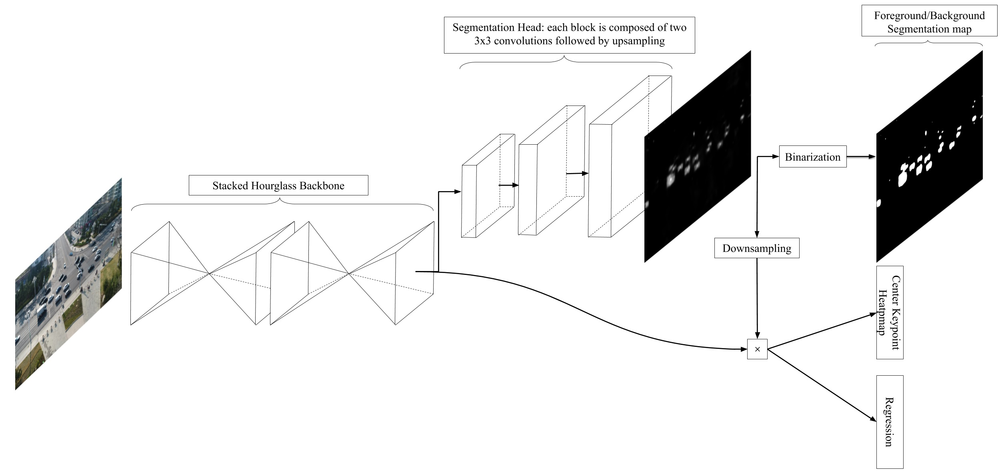

   
   
# SpotNet
Repository for the paper SpotNet: Self-Attention Multi-Task Network for Object Detection
  by Hughes Perreault1, Guillaume-Alexandre Bilodeau1, Nicolas Saunier1 and Maguelonne Héritier2.
 
1 Polytechnique Montréal
2 Genetec  
Paper: https://arxiv.org/abs/2002.05540  
Video: https://www.youtube.com/watch?v=JatQ-lziHO4

## Abstract
Humans are very good at directing their visual attention toward relevant areas when they search for different types of objects. For instance, when we search for cars, we will look at the streets, not at the top of buildings. The motivation of this paper is to train a network to do the same via a multi-task learning approach. To train visual attention, we produce foreground/background segmentation labels in a semi-supervised way, using background subtraction or optical flow. Using these labels, we train an object detection model to produce foreground/background segmentation maps as well as bounding boxes while sharing most model parameters. We use those segmentation maps inside the network as a self-attention mechanism to weight the feature map used to produce the bounding boxes, decreasing the signal of non-relevant areas. We show that by using this method, we obtain a significant mAP improvement on two traffic surveillance datasets, with state-of-the-art results on both UA-DETRAC and UAVDT.

## Model

Overview of SpotNet: the input image first passes through a double-stacked hourglass network; the segmentation head then produces an attention map that multiplies the final feature map of the backbone network; the final center keypoint heatmap is then produced as well as the size and coordinate offset regressions for each object.

## Organization of the Repository
* object detection: code used to perform object detection. Mainly borrowed from [CenterNet](https://github.com/xingyizhou/CenterNet), please refer to their repo for installation instructions.
* semi-supervised segmentation: code used to produce our semi-supervised ground-truth.
* results: our results for the two evaluated datasets.
* CRV 2020 conference material: poster and presentation for the CRV 2020 conference.
* imgs: images used in the repo.

## Results

For the official references, please refer to the paper.

### Results on UA-DETRAC

| Model                                      | Overall          | Easy             | Medium           | Hard             | Cloudy           | Night            | Rainy            | Sunny            |
|--------------------------------------------|------------------|------------------|------------------|------------------|------------------|------------------|------------------|------------------|
| SpotNet (ours)                             | 86.80% | 97.58% | 92.57% | 76.58% | 89.38% | 89.53% | 80.93% | 91.42% |
| CenterNet | 83.48%          | 96.50%          | 90.15%          | 71.46%          | 85.01%          | 88.82%          | 77.78%          | 88.73%          |
| FG-BR\_Net         | 79.96%          | 93.49%          | 83.60%          | 70.78%          | 87.36%          | 78.42%          | 70.50%          | 89.8%           |
| HAT            | 78.64%          | 93.44%          | 83.09%          | 68.04%          | 86.27%          | 78.00%          | 67.97%          | 88.78%          |
| GP-FRCNNm         | 77.96%          | 92.74%          | 82.39%          | 67.22%          | 83.23%          | 77.75%          | 70.17%          | 86.56%          |
| R-FCN           | 69.87%          | 93.32%          | 75.67%          | 54.31%          | 74.38%          | 75.09%          | 56.21%          | 84.08%          |
| EB            | 67.96%          | 89.65%          | 73.12%          | 53.64%          | 72.42%          | 73.93%          | 53.40%          | 83.73%          |
| Faster R-CNN          | 58.45%          | 82.75%          | 63.05%          | 44.25%          | 66.29%          | 69.85%          | 45.16%          | 62.34%          |
| YOLOv2       | 57.72%          | 83.28%          | 62.25%          | 42.44%          | 57.97%          | 64.53%          | 47.84%          | 69.75%          |
| RN-D              | 54.69%          | 80.98%          | 59.13%          | 39.23%          | 59.88%          | 54.62%          | 41.11%          | 77.53%          |
| 3D-DETnet       | 53.30%          | 66.66%          | 59.26%          | 43.22%          | 63.30%          | 52.90%          | 44.27%          | 71.26%          |

### Results on UAVDT

| Model                                      | Overall          |
|--------------------------------------------|------------------|
| SpotNet (Ours)                             | 52.80% |
| CenterNet | 51.18%          |
| Wang \etal        | 37.81%          |
| R-FCN           | 34.35%          |
| SSD                      | 33.62%          |
| Faster-RCNN          | 22.32%          |
| RON                   | 21.59%          |

## Acknowledgements
The code for this paper is mainly built upon [CenterNet](https://github.com/xingyizhou/CenterNet), we would therefore like to thank the authors for providing the source code of their paper. We also acknowledge the support of the Natural Sciences and Engineering Research Council of Canada (NSERC), [RDCPJ 508883 - 17], and the support of Genetec.
